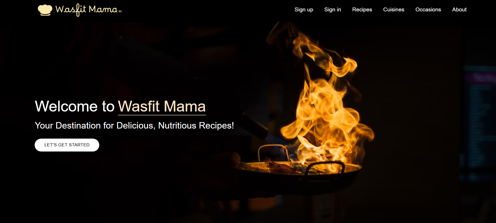
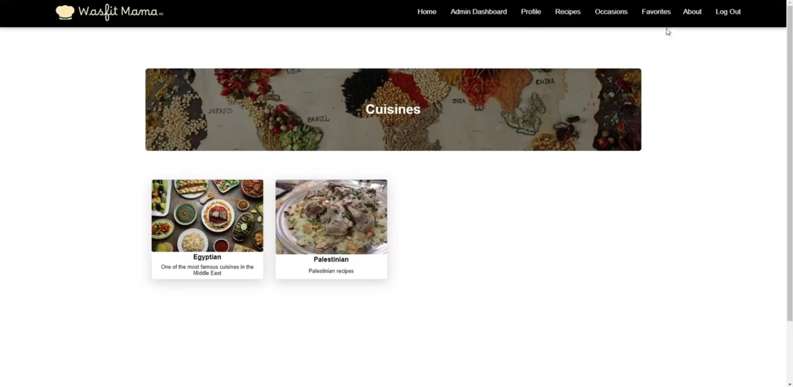

# Wasfit Mama

## Overview
Wasfit Mama is a **Django-based recipe finder website** where users can explore a variety of recipes, search by name, cuisine, or occasion, and save their favorite recipes for later. Admins have full control over the recipe database, allowing them to add, update, and delete entries.

## Features
- 🔍 **Search Recipes:** Users can search for recipes by name, cuisine, or occasion.
- ❤️ **Favorites:** Users can save recipes to their favorites for quick access.
- 🔧 **Admin Panel:** Admins can manage recipes by adding, updating, or deleting entries.
- 🎨 **User-Friendly Interface:** A simple and intuitive frontend using HTML, CSS, and JavaScript.
- 🔐 **User Authentication:** Users can register, log in, and log out securely.
- 🖼️ **Profile Management:** Users can update their profile picture and other details.

## 🛠 Technologies Used
- **Backend:** Django
- **Frontend:** HTML, CSS, JavaScript
- **Database:** SQLite
- **Authentication:** Django built-in authentication system

## 📷 Screenshots

---

Enjoy cooking with **Wasfit Mama**! 🍽️